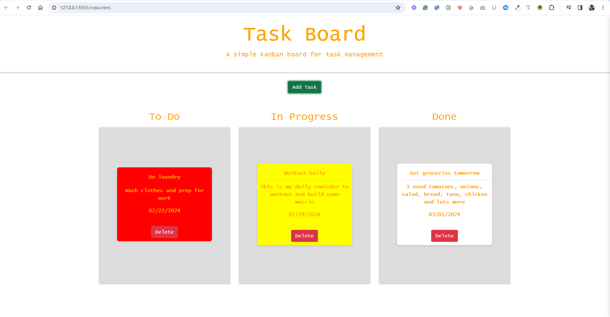

# Task-board
This repository creates a task board with functionality such as date and time picker as well as drag and drop.

### REPOSITORY DESCRIPTION

REPOSITORY NAME: Task-board

This repository is created for Assignment 8: Using 3rd party API's/libraries
It contains and index.html, script.js, style.css accordingly.

### SCREENSHOT

### RELATED LINKS
[Github repository:](https://github.com/Prince-grandev)

[Github application:](https://github.com/Prince-grandev/Task-board)

### BRIEF INTRODUCTION
This project was very technical and incorporated jquery in creating intelligent features such as drag and drop and date and time utilization.

### PROCEDURE
Create the assets necessary to make the application code
Reference these assets in Javascript file.
In addition, create function that display functionality needed.

#### Drag and drop functionality

Integrate jquery feature through tis library

#### Date picker functionality

Integrate date and time library with Javascript code.

### CONCLUSION
The exercise was brilliant and definitely incentivised doing more reading and research. It shows that functionality can be greatly improved when external libraries and apis are utilized.